# Lab 13 — Multi-Agent System: IT Support Automation

## Overview

This project implements an automated IT support ticketing system built on a **multi-agent architecture**. Incoming support tickets are processed through a sequential pipeline of specialized agents — classifier, knowledge base lookup, response generation, and escalation — all coordinated by a central orchestrator over NATS pub/sub messaging. Redis provides shared state and ticket history. OpenTelemetry traces flow to Jaeger for end-to-end visibility. An optional LLM agent (Claude via Anthropic API) polishes generated responses, and a FastAPI dashboard provides real-time monitoring and manual ticket submission.

## Architecture

```mermaid
flowchart TD
    Client([Client / curl])
    Dashboard[Dashboard\nFastAPI :8080]
    Orchestrator[Orchestrator\nPython]
    Classifier[Classifier\nGo]
    Knowledge[Knowledge\nGo]
    Responder[Responder\nGo]
    Escalation[Escalation\nGo]
    LLM[LLM Agent\nPython]
    Redis[(Redis\n:6379)]
    Jaeger[(Jaeger\n:16686)]
    NATS[[NATS\n:4222 / :8222]]

    Client -->|POST /api/tickets| Dashboard
    Dashboard -->|tickets.incoming| NATS
    NATS -->|tickets.incoming| Orchestrator

    Orchestrator -->|agents.bid_request| NATS
    NATS -->|agents.bid_request| Classifier
    Classifier -->|agents.bid_response.<task_id>| NATS
    NATS -->|agents.bid_response.*| Orchestrator
    Orchestrator -->|agents.task.<agent_id>\nor tickets.classify| NATS
    NATS -->|tickets.classify| Classifier
    Classifier -->|tickets.classified| NATS
    NATS -->|tickets.classified| Orchestrator

    Orchestrator -->|tickets.find_solution| NATS
    NATS -->|tickets.find_solution| Knowledge
    Knowledge <-->|GET/SET| Redis
    Knowledge -->|tickets.solution_found| NATS
    NATS -->|tickets.solution_found| Orchestrator

    Orchestrator -->|tickets.generate_response| NATS
    NATS -->|tickets.generate_response| Responder
    Responder -->|tickets.response_ready| NATS
    NATS -->|tickets.response_ready| Orchestrator

    Orchestrator -->|tickets.escalate| NATS
    NATS -->|tickets.escalate| Escalation
    Escalation -->|tickets.escalated\ntickets.audit| NATS
    NATS -->|tickets.escalated| Orchestrator

    Orchestrator -->|tickets.llm_enhance| NATS
    NATS -->|tickets.llm_enhance| LLM
    LLM -->|tickets.llm_enhanced| NATS
    NATS -->|tickets.llm_enhanced| Orchestrator

    Orchestrator -->|tickets.completed| NATS
    Orchestrator <-->|ticket history| Redis

    Classifier -->|agents.heartbeat| NATS
    Knowledge -->|agents.heartbeat| NATS
    Responder -->|agents.heartbeat| NATS
    Escalation -->|agents.heartbeat| NATS
    NATS -->|agents.heartbeat| Dashboard

    Classifier -.->|OTLP traces| Jaeger
    Knowledge -.->|OTLP traces| Jaeger
    Responder -.->|OTLP traces| Jaeger
    Escalation -.->|OTLP traces| Jaeger
    Orchestrator -.->|OTLP traces| Jaeger
```



## Agents

| Agent | Lang | Subscribes | Publishes | Description |
|-------|------|-----------|-----------|-------------|
| **classifier** | Go | `tickets.classify`<br>`agents.bid_request`<br>`agents.task.<id>` | `tickets.classified`<br>`agents.bid_response.<task_id>`<br>`agents.heartbeat` | Classifies tickets by category (network, hardware, software, account) and priority (low, medium, critical) using keyword rules; participates in auction bidding |
| **knowledge** | Go | `tickets.find_solution`<br>`knowledge.stats` | `tickets.solution_found`<br>`agents.heartbeat` | Searches an in-memory knowledge base for matching articles; caches results in Redis and replies with found articles and cache-hit status |
| **responder** | Go | `tickets.generate_response` | `tickets.response_ready`<br>`agents.heartbeat` | Generates a templated support response from KB articles, category, and priority with an estimated resolution time |
| **escalation** | Go | `tickets.escalate` | `tickets.escalated`<br>`tickets.audit`<br>`agents.heartbeat` | Routes critical or unresolvable tickets to the appropriate support tier, generates an escalation record and audit log entry |
| **llm_agent** | Python | `tickets.llm_enhance` | `tickets.llm_enhanced` | Optionally enriches responses using the Anthropic API (claude-sonnet-4-20250514); falls back to the draft response when no API key is configured |
| **orchestrator** | Python | `tickets.incoming`<br>`tickets.classified`<br>`tickets.solution_found`<br>`tickets.response_ready`<br>`tickets.escalated`<br>`tickets.llm_enhanced` | `tickets.classify`<br>`tickets.find_solution`<br>`tickets.generate_response`<br>`tickets.escalate`<br>`tickets.llm_enhance`<br>`tickets.completed`<br>`agents.bid_request` | Drives the full pipeline with retries and timeouts; supports both broadcast and auction dispatch; auto-scales classifiers via Docker API |
| **dashboard** | Python | `agents.heartbeat` | `tickets.incoming` | FastAPI web UI showing live agent status, NATS metrics, Redis stats, and ticket history; exposes REST endpoints for manual ticket submission |

## Tasks Completed

| # | Task | Description |
|---|------|-------------|
| 1 | **Go Agents** | Implement all 4 Go agents — classifier, knowledge, responder, escalation — each with NATS pub/sub and structured logging |
| 2 | **Orchestrator Pipeline** | Python orchestrator that chains agents into a sequential pipeline with branching (respond vs. escalate), timeouts, and retries |
| 3 | **Distributed Tracing** | OpenTelemetry instrumentation across all services with trace-context propagation via NATS headers; Jaeger as the backend |
| 4 | **Redis State** | Knowledge agent stores query results in Redis with TTL; orchestrator persists last 50 completed tickets to `tickets:history` |
| 5 | **Dynamic Scaling** | Orchestrator monitors `tickets.classify` queue depth via NATS `/subsz` and launches/stops extra classifier containers using the Docker SDK |
| 6 | **Auction Dispatch** | `AuctionOrchestrator` broadcasts bid requests to classifiers, collects cost/capacity bids, selects the winner by lowest cost-per-capacity score, then delivers the task directly |
| 7 | **LLM Enhancement** | Optional `llm_agent` service calls the Anthropic API to rewrite draft responses to be more empathetic and actionable; activated via `LLM_ENABLED=true` |
| 8 | **Web Dashboard** | FastAPI + Jinja2 dashboard at `:8080` shows live agent heartbeats, NATS message counters, Redis KB stats, per-ticket history, and a ticket submission form |

## How to Run

### Prerequisites

- [Docker](https://docs.docker.com/get-docker/) and Docker Compose v2+
- Go 1.22+ (for local development only)
- Python 3.11+ (for local development only)

### Quick Start

```bash
# Build and start all services
docker compose up --build

# To enable the optional LLM agent (requires ANTHROPIC_API_KEY):
ANTHROPIC_API_KEY=sk-ant-... docker compose --profile llm up --build

# Enable auction-based dispatch and LLM enhancement:
USE_AUCTION=true LLM_ENABLED=true docker compose --profile llm up --build
```

### Access Points

| Service | URL |
|---------|-----|
| Dashboard | http://localhost:8080 |
| Jaeger UI | http://localhost:16686 |
| NATS Monitoring | http://localhost:8222 |
| Redis | `localhost:6379` |

### Submit a Ticket Manually

```bash
curl -s -X POST http://localhost:8080/api/tickets \
  -H "Content-Type: application/json" \
  -d '{"title": "VPN not connecting", "description": "Cannot connect since this morning, tried restarting"}' \
  | jq .
```

Expected response:

```json
{
  "ticket_id": "MANUAL-A1B2C3D4",
  "status": "submitted"
}
```

Check ticket history:

```bash
curl -s http://localhost:8080/api/tickets | jq '.tickets[0]'
```

Check live agent status:

```bash
curl -s http://localhost:8080/api/status | jq '.agents'
```

## CI / GitHub Actions

The `.github/workflows/ci.yml` pipeline runs on every push and pull request to `main`:

| Job | Trigger | What it does |
|-----|---------|--------------|
| `lint-go` | push + PR | `golangci-lint` + `go test -race` for each of the 4 Go agents (matrix) |
| `lint-python` | push + PR | `ruff check` on all Python packages, then `pytest` on `orchestrator/` |
| `docker-build` | push + PR | `docker compose build --parallel` then verifies all 6 expected images exist |
| `auto-review` | PR only | Sends each changed `.go`/`.py` file to Claude API; posts review as PR comment; fails if any `CRITICAL:` issue is found |

### Required GitHub Secrets

Go to **Settings → Secrets and variables → Actions** in your GitHub repository and add:

| Secret | Required by | Description |
|--------|------------|-------------|
| `ANTHROPIC_API_KEY` | `auto-review` job | Anthropic API key used by `.github/scripts/auto_review.py` to call `claude-sonnet-4-20250514`. If the secret is absent the job exits 0 and skips the review rather than failing. |

`GITHUB_TOKEN` is provided automatically by GitHub Actions and does not need to be added manually.

## Environment Variables

| Variable | Default | Used By | Description |
|----------|---------|---------|-------------|
| `NATS_URL` | `nats://localhost:4222` | all | NATS server connection URL |
| `NATS_MONITOR_URL` | `http://nats:8222` | orchestrator, dashboard | NATS HTTP monitoring endpoint |
| `REDIS_URL` | `redis://redis:6379` | knowledge, orchestrator, dashboard | Redis connection URL |
| `OTEL_SERVICE_NAME` | *(per service)* | all Go agents, orchestrator | OpenTelemetry service name tag |
| `OTEL_EXPORTER_OTLP_ENDPOINT` | `http://jaeger:4318` | all Go agents, orchestrator | OTLP/HTTP traces endpoint |
| `ANTHROPIC_API_KEY` | *(empty)* | llm_agent | Anthropic API key; LLM agent falls back to draft when unset |
| `USE_AUCTION` | `false` | orchestrator | Set `true` to use auction-based classifier dispatch |
| `LLM_ENABLED` | `false` | orchestrator | Set `true` to invoke the LLM enhancement step after response generation |
| `CLASSIFIER_IMAGE` | `lab13-mas-support-classifier` | orchestrator (scaler) | Docker image name used when spawning extra classifier replicas |
| `DOCKER_NETWORK` | `lab13-mas-support_default` | orchestrator (scaler) | Docker network to attach scaled replicas to |
| `DOCKER_HOST` | `unix:///var/run/docker.sock` | orchestrator (scaler) | Docker socket path (mounted as volume in compose) |

## Project Structure

```
lab13-mas-support/
├── agents/
│   ├── classifier/          # Go — ticket classification + auction bidding
│   │   ├── main.go
│   │   ├── classifier.go
│   │   ├── bidding.go
│   │   ├── tracing.go
│   │   ├── classifier_test.go
│   │   ├── bidding_test.go
│   │   ├── Dockerfile
│   │   └── go.mod
│   ├── knowledge/           # Go — KB search with Redis caching
│   │   ├── main.go
│   │   ├── knowledge.go
│   │   ├── handler.go
│   │   ├── store.go
│   │   ├── tracing.go
│   │   ├── knowledge_test.go
│   │   ├── store_test.go
│   │   ├── Dockerfile
│   │   └── go.mod
│   ├── responder/           # Go — response generation from KB articles
│   │   ├── main.go
│   │   ├── responder.go
│   │   ├── tracing.go
│   │   ├── responder_test.go
│   │   ├── Dockerfile
│   │   └── go.mod
│   └── escalation/          # Go — ticket escalation + audit logging
│       ├── main.go
│       ├── escalation.go
│       ├── tracing.go
│       ├── escalation_test.go
│       ├── Dockerfile
│       └── go.mod
├── orchestrator/            # Python — pipeline coordinator + autoscaler
│   ├── main.py
│   ├── pipeline.py
│   ├── auction.py
│   ├── scaler.py
│   ├── tracing.py
│   ├── auction_test.py
│   ├── Dockerfile
│   └── requirements.txt
├── llm_agent/               # Python — Anthropic API response enhancement
│   ├── agent.py
│   ├── Dockerfile
│   └── requirements.txt
├── dashboard/               # Python — FastAPI monitoring dashboard
│   ├── app.py
│   ├── templates/
│   │   └── index.html
│   ├── Dockerfile
│   └── requirements.txt
├── docker-compose.yml
├── prompt_log.md
└── README.md
```
